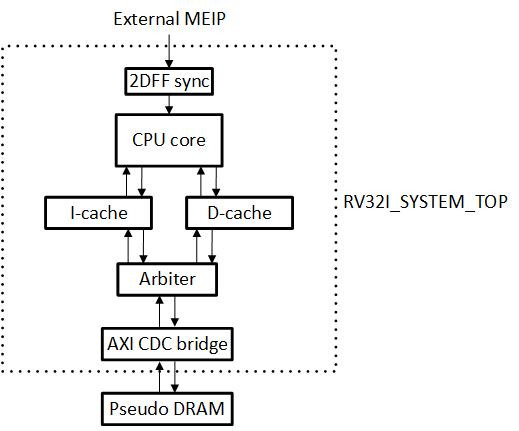
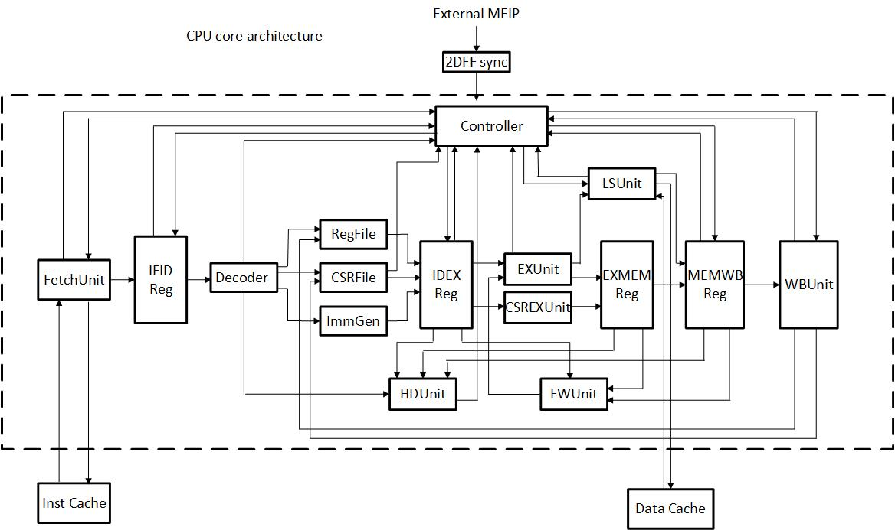

# RV32I 5-Stage Pipelined CPU System

- [中文說明](#中文說明)
- [English](#english)

## 中文說明

### Introduction

這是我在修習 ICLAB 與計算機結構後完成的 RISC-V CPU side project，主要目的是把 CPU pipeline、cache、AXI interconnect、CDC 與基本 ASIC flow 串成一個可以實際驗證的系統。

CPU core 採用 single-issue、in-order 五級 pipeline，支援完整 RV32I base instruction set、六條 Zicsr 指令，以及 Machine-mode exception、external interrupt、trap handling 和 `MRET`。

### System Architecture



系統由 CPU core、blocking I-cache、blocking D-cache、AXI4 arbiter 和 AXI CDC bridge 組成。I-cache 與 D-cache 共用一組外部 AXI4 interface；CPU 與 memory clock 不同時，五個 AXI channel 會透過 asynchronous FIFO 跨 clock domain。

`pseudo_DRAM` 是 simulation 使用的 AXI memory model，不包含在 synthesizable `RV32I_SYSTEM_TOP` 內。外部 `MEIP` 會先經過 2-FF synchronizer，再送進 CPU。

### CPU Core



Pipeline 分成 IF、ID、EX、MEM 和 WB，級間使用 `IFIDReg`、`IDEXReg`、`EXMEMReg` 與 `MEMWBReg` 保存資料。每個 pipeline register 都有 `reg_valid`；只有 `reg_valid=1` 時，該級的 instruction、control signal 與 exception metadata 才有效。

一般 GPR RAW dependency 由 EX/MEM 與 MEM/WB forwarding 處理。Load-use hazard 會 hold IF/ID 並在 ID/EX 插入 bubble。CSR 在 ID stage 讀取、WB stage 更新，因此 CSR 指令本身的輸入（rs1 與 CSR 內容）相依時採用 stall，而沒有另外建立 CSR forwarding path；CSR 指令讀出的舊值（即將寫入 `rd`）則和一般指令的結果一樣可以被 forward。

`LSUnit` 在 EX stage 產生 load/store address、alignment exception 與 D-cache request，並在 MEM stage 等待 response、處理 access fault 與 stall，因此功能上橫跨 EX 和 MEM。當 memory transaction 尚未完成時，Controller 會 hold pipeline，避免同一筆 request 被重複送出。

Branch、`JAL` 與 `JALR` 在 EX stage 決定 redirect。Exception 會和 instruction 一起向後傳遞；若不同 stage 同時出現 exception，Controller 會保留較老的事件，並阻止較年輕 instruction 產生 side effect。

如果想了解更詳細的設計，包含 pipeline 控制、forwarding 與 hazard、exception / interrupt 處理、cache、AXI arbiter 和 CDC bridge，請參考 [`docs/Architecture.md`](./docs/Architecture.md)。

### Main Features

- 完整的 RV32I base instruction set
- 六條 Zicsr 指令與精簡的 Machine-mode CSR
- Machine-mode exception、external interrupt、trap handling 與 `MRET`
- Data forwarding、load-use 偵測與 CSR dependency stall
- Blocking I-cache 與 D-cache
- Cache line refill 與 dirty line writeback
- 指令與資料流量共用的 AXI4 arbiter
- 使用 asynchronous FIFO 的五 channel AXI CDC bridge
- 可合成的 system top，CPU 與 memory 使用不同 clock

### Repository Structure

```text
RTL/           可合成的 CPU、cache、interconnect、CDC 與 system top RTL
verification/  Testbench、pattern、CPU checker、coverage 與 memory model
tests/         測試程式、DRAM image 與 golden 結果
scripts/       VCS filelist 與 regression script
docs/          架構、驗證與結果說明
picture/       README 使用的架構圖
```

各測試的目的與 golden file 格式整理在 [`tests/README.md`](./tests/README.md)，
VCS script 的參數與輸出位置整理在 [`scripts/README.md`](./scripts/README.md)。

### ISA Scope

目前實作的 Machine-mode CSR 包含 `mstatus`、`mie`、`mtvec`、`mepc`、`mcause`、`mtval` 和 `mip`。未實作的 CSR address 會產生 illegal-instruction exception。

同步例外包含 instruction/load/store address misaligned、instruction/load/store access fault、illegal instruction、breakpoint，以及 Machine-mode `ECALL`。外部中斷目前只支援 Machine external interrupt。

在目前 in-order、blocking cache，且不包含 MMIO、DMA 與 cache coherence 的範圍內，`FENCE` 不需要觸發額外的 cache operation，會作為沒有其他副作用的指令通過 pipeline。`EBREAK` 會進入一般的 Machine-mode trap handler，因為未實作 debug mode。

未實作 RV32M、compressed instructions 與 `FENCE.I`。

### Verification

目前完成的驗證包含：

- RV32I 與 Zicsr instruction smoke tests
- Exception、trap、`MRET` 與 external interrupt directed tests
- Pipeline hold、redirect、exception priority 和 interrupt drain corner cases
- SystemVerilog Assertions 與 functional coverage
- 使用 Spike commit trace 產生 golden result 的 random program test
- Synthesis、gate-level simulation 與 power analysis

System-level testbench、golden 比對、SVA 與 functional coverage 的分工整理在
[`docs/Verification.md`](./docs/Verification.md)。

Synthesis、gate-level simulation 和 power report 的摘要整理在
[`docs/Results.md`](./docs/Results.md)。

### Quick Start

目前公開的 regression flow 使用 Synopsys VCS。第一次執行前先設定 script 的
execute permission：

```bash
chmod +x scripts/run_non_irq_vcs.sh scripts/run_irq_vcs.sh
```

列出 case 或只跑一支測試：

```bash
./scripts/run_non_irq_vcs.sh list
./scripts/run_non_irq_vcs.sh branch_taken

./scripts/run_irq_vcs.sh list
./scripts/run_irq_vcs.sh irq_single_sync
```

不指定 case 時會執行該分類的完整 regression：

```bash
DUMP_FSDB=0 ./scripts/run_non_irq_vcs.sh
DUMP_FSDB=0 ./scripts/run_irq_vcs.sh
```

Compile 與 simulation 產物會放在 `out/vcs/`。單支測試預設保留 FSDB；完整
regression 可使用 `KEEP_FSDB=1` 保留所有波形。若環境沒有 Verdi FSDB PLI，
可使用 `DUMP_FSDB=0`。

### Verification Status

| Item | Current status |
| --- | --- |
| Non-IRQ regression | 30 / 30 PASS |
| IRQ regression | 3 / 3 PASS |

以上為整理後的 repository 結構下，使用預設設定（seed 1）實際執行的結果。

### Development and AI Assistance

本專案的 RTL 除了 SRAM model 皆由我親自設計並撰寫。AI 工具曾用於討論架構設計、code review、debug 討論、corner-case 整理、自動化腳本生成與文件修改／整理。

部分 verification pattern 與測試用的 assembly code 由我親自撰寫；另有一部分 pattern 與 assembly code 由我定義驗證需求、交由 AI 撰寫，再由我執行 simulation 並分析波形是否符合需求。SVA 與 functional coverage 由我撰寫，並請 AI 協助 review。

AI 也協助撰寫本 README 與 `docs/` 底下的文件。

### Notes

本專案以功能驗證和完整整合流程為主，並不是完整的 RISC-V privileged implementation，也未進行 APR 或 timing sign-off。公開版本的 SRAM 以 behavioral model 實作；synthesis、gate-level simulation 與 power analysis 使用的 netlist、SRAM macro 與 library 和製程相關，不包含在 repository 中，結果摘要請見 [`docs/Results.md`](./docs/Results.md)。

---

## English

### Introduction

This is a RISC-V CPU side project I built after taking ICLAB and computer architecture courses. Its goal is to connect the CPU pipeline, caches, AXI interconnect, clock domain crossing (CDC) and a basic ASIC flow into one system that can be verified end to end.

The CPU core is a single-issue, in-order, five-stage pipeline. It supports the complete RV32I base instruction set, six Zicsr instructions, and Machine-mode exceptions, external interrupts, trap handling and `MRET`.

### System Architecture


The system consists of the CPU core, a blocking I-cache, a blocking D-cache, an AXI4 arbiter and an AXI CDC bridge. The two caches share one external AXI4 interface. When the CPU and memory clocks differ, the five AXI channels cross clock domains through asynchronous FIFOs.

`pseudo_DRAM` is the AXI memory model used in simulation and is not part of the synthesizable `RV32I_SYSTEM_TOP`. The external `MEIP` signal passes through a 2-FF synchronizer before it reaches the CPU.

### CPU Core


The pipeline has five stages (IF, ID, EX, MEM and WB). The pipeline registers `IFIDReg`, `IDEXReg`, `EXMEMReg` and `MEMWBReg` sit between them. Every pipeline register has a `reg_valid` bit; the instruction, control signals and exception metadata of a stage are valid only when `reg_valid=1`.

General-purpose register RAW dependencies are handled by EX/MEM and MEM/WB forwarding. A load-use hazard holds IF/ID and inserts a bubble into ID/EX. CSRs are read in the ID stage and updated in the WB stage, so a dependency on the inputs of a CSR instruction (rs1 or the CSR value) is resolved by stalling instead of building a separate CSR forwarding path. The old CSR value that a CSR instruction writes to `rd` can be forwarded like any other result.

`LSUnit` generates the load/store address, alignment exceptions and D-cache requests in the EX stage, then waits for the response and handles access faults and stalls in the MEM stage, so it functionally spans EX and MEM. While a memory transaction is incomplete, the Controller holds the pipeline so the same request is not issued twice.

Branches, `JAL` and `JALR` decide their redirect in the EX stage. An exception travels down the pipeline together with its instruction. If several stages report an exception at the same time, the Controller keeps the oldest event and prevents younger instructions from producing side effects.

For more design details, including pipeline control, forwarding and hazards, exception / interrupt handling, the caches, the AXI arbiter and the CDC bridge, see [`docs/Architecture.md`](./docs/Architecture.md) (written in Chinese).

### Main Features

- Complete RV32I base instruction set
- Six Zicsr instructions and a small Machine-mode CSR set
- Machine-mode exception, external interrupt, trap handling and `MRET`
- Data forwarding, load-use detection and CSR dependency stall
- Blocking I-cache and D-cache
- Cache-line refill and dirty-line writeback
- Shared AXI4 arbiter for instruction and data traffic
- Five-channel AXI CDC bridge using asynchronous FIFOs
- Synthesizable system top with separate CPU and memory clocks

### Repository Structure

```text
RTL/           Synthesizable CPU, cache, interconnect, CDC and system-top RTL
verification/  Testbench, patterns, CPU checker, coverage and memory model
tests/         Test programs, DRAM images and golden results
scripts/       VCS filelists and regression scripts
docs/          Architecture, verification and results documents
picture/       Architecture diagrams used by this README
```

The purpose of each test and the golden file formats are described in [`tests/README.md`](./tests/README.md). The VCS script options and output locations are described in [`scripts/README.md`](./scripts/README.md).

### ISA Scope

The implemented Machine-mode CSRs are `mstatus`, `mie`, `mtvec`, `mepc`, `mcause`, `mtval` and `mip`. An access to an unimplemented CSR address raises an illegal-instruction exception.

The synchronous exceptions are instruction/load/store address misaligned, instruction/load/store access fault, illegal instruction, breakpoint and Machine-mode `ECALL`. The only supported interrupt is the Machine external interrupt.

Within the current scope (in-order core, blocking caches, and no MMIO, DMA or cache coherence), `FENCE` does not need to trigger any cache operation and passes through the pipeline as an instruction with no other side effects. `EBREAK` enters the normal Machine-mode trap handler because debug mode is not implemented.

RV32M, compressed instructions and `FENCE.I` are not implemented.

### Verification

The completed verification includes:

- RV32I and Zicsr instruction smoke tests
- Directed tests for exceptions, traps, `MRET` and external interrupts
- Corner cases for pipeline hold, redirect, exception priority and interrupt drain
- SystemVerilog Assertions and functional coverage
- A random program test whose golden result is generated from a Spike commit trace
- Synthesis, gate-level simulation and power analysis

How the system-level testbench, golden comparison, SVA and functional coverage divide the work is described in [`docs/Verification.md`](./docs/Verification.md) (written in Chinese).

A summary of the synthesis, gate-level simulation and power reports is in [`docs/Results.md`](./docs/Results.md) (written in Chinese).

### Quick Start

The public regression flow uses Synopsys VCS. Before the first run, set the execute permission of the scripts:

```bash
chmod +x scripts/run_non_irq_vcs.sh scripts/run_irq_vcs.sh
```

List the cases, or run a single test:

```bash
./scripts/run_non_irq_vcs.sh list
./scripts/run_non_irq_vcs.sh branch_taken

./scripts/run_irq_vcs.sh list
./scripts/run_irq_vcs.sh irq_single_sync
```

Without a case name, the script runs the full regression of that category:

```bash
DUMP_FSDB=0 ./scripts/run_non_irq_vcs.sh
DUMP_FSDB=0 ./scripts/run_irq_vcs.sh
```

Build and simulation outputs are written to `out/vcs/`. A single-case run keeps its FSDB by default; use `KEEP_FSDB=1` to keep every waveform of a full regression. If the environment has no Verdi FSDB PLI, use `DUMP_FSDB=0`.

### Verification Status

| Item | Current status |
| --- | --- |
| Non-IRQ regression | 30 / 30 PASS |
| IRQ regression | 3 / 3 PASS |

These are the results of actual runs with the default settings (seed 1) on the reorganized repository structure.

### Development and AI Assistance

Except for the SRAM model, the RTL of this project was designed and written by me. I used AI tools to discuss the architecture, review code, discuss debugging, organize corner cases, generate automation scripts, and edit and organize documents.

I wrote some of the verification patterns and test assembly code myself. For other patterns and assembly programs, I defined the verification requirements and had AI write them, then ran the simulations and analyzed the waveforms to check that they meet the requirements. I wrote the SVA and functional coverage myself and asked AI to review the code.

AI also helped write this README and the documents under `docs/`.

### Notes

This project focuses on functional verification and a complete integration flow. It is not a complete RISC-V privileged implementation, and it has not gone through APR or timing sign-off. The SRAMs in the public version are behavioral models. The netlist, SRAM macros and libraries used for synthesis, gate-level simulation and power analysis depend on the process technology and are not included in this repository; see [`docs/Results.md`](./docs/Results.md) for a summary of the results.
