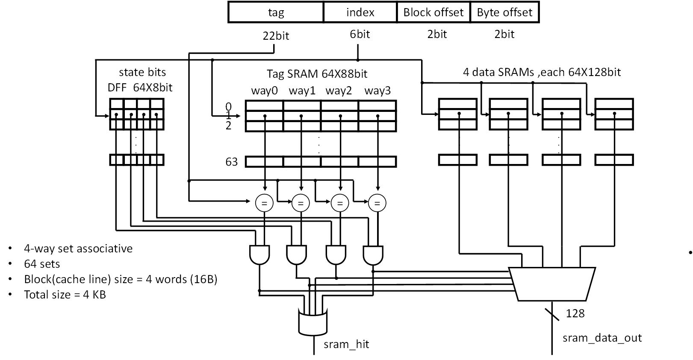

# RV32I 5-Stage Pipelined CPU system detailed architecture

## CPU Core

### pipeline introduction

Pipeline 分成 IF、ID、EX、MEM 和 WB，級間使用 IFIDReg、IDEXReg、EXMEMReg 與 MEMWBReg 保存資料。每個 pipeline register 都有 reg_valid；只有 reg_valid=1 時，該級的 instruction、control signal 與 exception metadata 才有效。所有 pipeline register 都有三個狀態
- Advance : 接受前級的 payload 以及 reg_valid
- Hold : 保持 payload / reg_valid 的狀態不動
- Bubble : 將 reg_valid 設為 0。Pipeline register 中的其他 payload 可能保留原值，但因為 reg_valid=0，這些資料不具有效力。

### module list
以下介紹圖中各 module 的作用
- **Controller** : 控制整條 pipeline 的運行。會根據各 module 傳送的資訊去決定各級 pipeline register 的狀態、FetchUnit 是否對 I-cache 發送 request、LSUnit 是否對 D-cache 發送 request、WB stage 中的指令是否可以 commit、是否接受 interrupt 以及發生 exception 時，如何實作 precise exception 等等判斷。
- **FetchUnit** : 維護 program counter，並根據 Controller 指示決定是否跟 I-cache 取指令，將取出的指令供應給 IFIDReg，並在 I-cache access fault 時產生 exception 資訊。
- **IFIDReg** : 保存 FetchUnit 的輸出資訊，並由 Controller 控制狀態。
- **Decoder** : 對 IFIDReg 中的指令進行解碼，而 illegal instruction、ECALL 以及 EBREAK 的 exception 資訊也在這裡產生。
- **ImmGen** : 根據指令的類別產生給 ALU 等模組使用的 immediate。
- **RegFile** : 存放 RV32I 中的 32 個 GPR(general purpose register)，並進行 register file 的讀取和寫入。
- **CSRFile** : Machine-mode CSR，包含 mstatus、mie、mtvec、mepc、mcause、mtval 和 mip，並進行讀取和寫入。
- **IDEXReg** : 保存 ID stage 的輸出資訊，並由 Controller 控制狀態。
- **EXUnit** : 進行計算，並判斷該指令是否產生跳轉，並產生跳轉的地址。instruction / Load / Store address misalignment 的 exception 資訊也在這裡產生。
- **CSREXUnit** : 進行六條 CSR 指令的計算。
- **LSUnit** : 根據指令種類對 Cache 產生 Load / Store 的 request 並接收 response。並根據有沒有 handshake 或是 cache response 有沒有回來，傳送訊號給 controller 決定是否 stall。Load / Store access fault 的 exception 資訊也在這裡產生。
- **EXMEMReg** : 保存 EX stage 的輸出資訊，並由 Controller 控制狀態。
- **MEMWBReg** : 保存 MEM stage 的輸出資訊，並由 Controller 控制狀態。
- **WBUnit** : 決定寫回 RegFile / CSRFile 的 data 和要寫回的 register，並告訴 Controller 目前是否有 exception 應該 trap 或是目前該執行 mret。
- **HDUnit** : 根據各級資訊判斷是否有 RAW data hazard 給 Controller 進行 pipeline 控制。
- **FWUnit** : 進行 data forwarding。

### Jump & branch redirect
各種 jump & branch 的判斷都在 EX stage，但 Controller 會根據所有 stage 的狀態，決定是否真的 redirect，若真的 redirect，則會在 IFIDReg 和 IDEXReg 塞 Bubble。Redirect 前已經送出的舊 I-cache response 也不能再寫入 pipeline。

### Forwarding & load use hazard & CSR hazard
- Forwarding: FWUnit 會比較 IDEXReg 中的 rs1 / rs2 與 EXMEMReg、MEMWBReg 中的 rd。只有來源 stage 的 `reg_valid=1`（指令有效）、`reg_we=1`（會寫回 GPR），而且 `rd != x0` 時，register number 相同才會成立 forwarding。FWUnit 會讓 EXUnit 使用 IDEXReg 原本保存的 operand，或是由較後面的 pipeline stage 取得新值；若 EXMEMReg 和 MEMWBReg 同時符合，則優先使用較新的 EXMEMReg 結果。可以被 forward 的結果包括 ALU 結果、immediate、PC+4 與 CSR 指令讀出的舊值；load 的資料只能從 MEMWBReg forward，所以才需要下面的 load-use stall。
- load use hazard: HDUnit 會確認 IFIDReg 和 IDEXReg 中的指令都有效，再檢查 EX stage 的 load 指令是否寫入非 x0 的 rd，且該 rd 與 ID stage 指令實際使用的 rs1 或 rs2 相同。若符合，就表示存在 load-use hazard，並告訴 Controller。Controller 會再根據情況，決定是否真的要 load use stall，意即將 IFIDReg hold 住，IDEXReg 塞 bubble。
- CSR hazard: CSR instruction 會在 ID stage 讀取 GPR operand 和 CSR 舊值，再將資料送入 IDEXReg。CPU 的一般 GPR data path 雖然有 forwarding，但 CSREXUnit 直接使用 IDEXReg 保存的 rs1 data 和 CSR 舊值，沒有使用 FWUnit 的輸出。因此 register-form CSR instruction 若相依於尚未寫回的 GPR，或 CSR instruction 要讀取前面尚未寫回的同一個 CSR，HDUnit 會讓它 stall，直到較老的 writeback 完成後才繼續執行。要注意的是，stall 只針對 CSR 指令本身的輸入（rs1 與 CSR 內容）；CSR 指令讀出的舊值（即將寫入 `rd`）對後續指令而言，仍是一般的 GPR forwarding。

### Exception age priority、trap、MRET、IRQ drain
本處是 precise exception 的關鍵。若在某個 stage 偵測到 exception，Controller 會決定該 exception 是否存活，因為在別的 stage 可能同時也發生 exception 或是 branch / jump 跳轉。大原則就是較舊 stage 的事件會壓掉年輕 stage 的事件，Pipeline 中越靠近 WB stage 的 instruction 越老，因此較老 instruction 的 exception 或 redirect 會壓掉較年輕的事件。例如 ID stage 偵測到 illegal instruction，但是 MEM stage 發生 Load access fault，那麼 Load access fault 的 exception 資訊會存活。exception 存活的話表示會將較年輕的指令全部 flush 掉，也就是 pipeline register 塞 bubble，並且 FetchUnit 停止取新的指令。而當較老的指令都完成 commit，exception 走到 WB stage，將會 trap 到 exception handler，意即跳轉到 mtvec 存放的 address。

而 MRET 的部分，當 decoder 解出 MRET 時，Controller 會讓 FetchUnit 停止取指令，並等待 MRET 走到 WB stage，再跳到 mepc 的地方。

precise interrupt 的部分，Controller 會根據 `mip.MEIP && mie.MEIE && mstatus.MIE` 判斷 external interrupt 是否符合接受條件。接受 IRQ 後，再根據 pipeline 的狀態決定是否進行 pipeline drain，也就是停止 fetch，等待 pipeline 中所有指令 commit 完，再跳到 handler，以此實現 precise interrupt。但有些情況不會馬上開始進行 pipeline drain，例如目前有 exception 在 pipeline 中，或是目前已經在 handler 了，就不會進行 pipeline drain。而像是正在 pipeline drain 途中發生 exception，也會停止 drain，因為等一下會跳到 exception handler。要等 mret 回來才能繼續。

## Cache Design
I-cache 和 D-cache 都採用 4-way set associative，共有 64 個 set，每條 cache line 為 16 bytes，因此兩顆 cache 的 data 容量各為 4 KiB。address 的切法如下：`[31:10]` 為 tag、`[9:4]` 為 index、`[3:2]` 選擇 line 中的 word，而 `[1:0]` 為 byte offset。

兩顆 cache 的 tag 和 data 都放在 synchronous SRAM 中。每個 set 有 4 個 way，若發生 miss 會先找 invalid way；4 個 way 都有效時，再由 3-bit tree-based pseudo-LRU 選擇 victim。CPU 端的 cache 介面是 blocking 的，所以 miss 尚未處理完成時，Controller 會先 hold 住 pipeline。

### I-cache

I-cache 只會接收 read request。hit 時會從 cache line 中選出對應的 32-bit instruction 送回 FetchUnit；miss 時則透過 AXI AR/R channel 讀取一整條 16-byte cache line，refill 完成後再把原本要求的 instruction 送回 CPU。I-cache 沒有 dirty data，因此替換 cache line 時不需要 writeback。

### D-cache

D-cache 採用 write-back 和 write-allocate。load hit 可以直接回覆 CPU；store hit 只更新 cache 並把該 cache line 標成 dirty，不會馬上寫回 memory。為了處理 synchronous SRAM 的 write latency 和 dirty line writeback，D-cache 另外加入 Store Buffer 和 Victim Buffer，細節分別寫在下面。

load miss 會透過 AXI AR/R channel 讀回一整條 cache line。若被替換的是 clean line，可以直接進行 refill；若是 dirty line，則先把它移到 Victim Buffer，再開始 refill。D-cache 也支援 flush，會掃過所有 set 和 way，把 dirty line 送入 Victim Buffer，等待 writeback 完成後再回覆 CPU。

#### Store Buffer

Store Buffer 共有 4 個 entry，用來暫存 store hit 的 address、data、byte mask 和所在的 way。store 進入 store buffer 後即可回覆 CPU，之後再由 store buffer 依序更新 synchronous SRAM，讓 CPU 不必等待 SRAM write 完成。若同一個 word 又收到 store，新資料會依 byte mask 合併到原本的 entry；load 碰到正在 store buffer 中的 address 時，也會將 store buffer 內有效的 bytes 覆蓋到 SRAM 或 victim buffer 提供的 base word 上。

#### Victim Buffer

Victim Buffer 共有 2 個 entry，用來保存被替換或 flush 出去的 dirty cache line，並透過 AXI AW/W/B channel 寫回 memory。cache line 放進 victim buffer 後，miss refill 可以繼續進行，不需要等整筆 writeback 結束。

Victim Buffer 中的 entry 會一直保留到對應的 B channel handshake 完成才失效。因此即使 AW 和 W channel 已經完成，只要還沒收到 write response，load 仍可 hit 到 victim buffer 並直接取得資料。此時若 Store Buffer 也有相同 word 的更新，仍會依 byte mask 把 Store Buffer 的新資料合併到 victim buffer 提供的 base word。store 遇到相同的 Victim Buffer entry 時則會先等待衝突解除。

### Access fault and SRAM idle gating

I-cache 和 D-cache 都會先檢查 CPU request 的 address range，若超出可存取範圍就回報 access fault，不會送出 AXI transaction。I-cache 可存取的範圍是 `0x0000_0000` 到 `0x0000_FFFC`，D-cache 則是 `0x0001_0000` 到 `0x0001_FFFC`。

SRAM 另外有 idle gating 的設計。開啟 `SRAM_IDLE_GATING` 後，只有需要比較 tag、refill、store 或 flush 時才會 enable 對應的 SRAM，其他時間保持關閉，用來降低不必要的 SRAM switching power。

## AXI Arbiter

I-cache 和 D-cache 共用一組對外的 AXI 介面，因此兩顆 cache 會先連到 Arbiter，再由 Arbiter 連到 AXI CDC Bridge。I-cache 接在 master0，D-cache 接在 master1。

AR 和 AW channel 各自進行 arbitration。只有一邊送出 request 時會直接選擇該 master；兩邊同時送出 request 時則使用 round-robin，避免其中一邊一直拿不到服務。owner 一旦選定，在 handshake 完成以前都不會改變，因此 memory 端尚未準備好（`READY=0`）時，Arbiter 仍會保持同一個 owner 與 AXI payload，直到 handshake 完成。

cache 端的 AXI ID 雖然是 4 bits，但 I-cache 和 D-cache 產生 request 時都把 `ID[3]` 固定為 0，只使用 `ID[2:0]` 作為 local ID。Arbiter 送到 shared AXI 時會重新設定 `ID[3]` 作為 source bit：0 代表 master0 (I-cache)，1 代表 master1 (D-cache)，而 `ID[2:0]` 維持原本的 local ID。R 和 B response 回來後，Arbiter 再根據 RID 或 BID 的最高位送回對應的 master，並將 master 端看到的最高位還原成 0。

W channel 本身沒有 ID，不能只看當下是哪個 master 送出 WVALID。因此每次 AW handshake 時，Arbiter 會把該筆 transaction 的 owner 存進 8-entry W owner FIFO。要開始傳送 write data 時，先從 FIFO 取出 owner 並保存到 W_owner，整個 burst 都只讓該 master 使用 W channel，直到 WLAST handshake 後才切換到下一筆 transaction。

## AXI CDC Bridge

CPU、cache 和 Arbiter 使用 `cpu_clk`，memory 端則使用 `mem_clk`。AXI CDC Bridge 放在 Arbiter 與外部 memory 之間，負責讓五個 AXI channel 跨越這兩個 clock domain。

- AR、AW 和 W 由 CPU domain 送往 memory domain。
- R 和 B 由 memory domain 送回 CPU domain。

五個 channel 各自使用一顆 32-entry asynchronous FIFO，彼此不共用儲存空間。各 FIFO 保存的 payload 如下：

| Channel | 傳輸方向 | FIFO payload | Width |
| :-- | :-- | :-- | --: |
| AR | CPU → Memory | ARID、ARADDR、ARLEN、ARSIZE、ARBURST | 49 bits |
| AW | CPU → Memory | AWID、AWADDR、AWLEN、AWSIZE、AWBURST | 49 bits |
| W | CPU → Memory | WDATA、WSTRB、WLAST | 37 bits |
| R | Memory → CPU | RID、RDATA、RRESP、RLAST | 39 bits |
| B | Memory → CPU | BID、BRESP | 6 bits |

五顆 FIFO 都使用相同的 32×64 dual-clock SRAM，沒有用到的高位補 0。write side 只有在 FIFO 未滿時才會將 AXI READY 拉高，並在 `VALID && READY` 時把整組 payload push 進 FIFO。若 destination 暫時無法接收，資料會先累積在 FIFO；FIFO 滿了之後，READY 會被拉低，讓來源端暫停送入新的資料，直到 FIFO 再次有空間。

read side 另外保存目前是否已有一筆有效的 output。output 空著時會先從 FIFO 讀出下一筆資料；VALID 拉高後，在對方完成 handshake 以前都不會再移動 read pointer，因此 payload 能保持不變。若目前的資料被接走，而且 FIFO 內還有下一筆，則會接著讀取下一個 entry，讓連續 transaction 不需要每筆都空一個 cycle。這層控制也處理了 synchronous SRAM 讀取需要一個 clock 才能取得資料的問題，不會讓 AXI VALID 依賴對方的 READY 才產生。

AFIFO 的 write pointer 和 read pointer 各自在自己的 clock domain 中更新，轉成 Gray code 後，再經過同步器送到另一個 domain。write side 使用同步過來的 read pointer 判斷 full，read side 則使用同步過來的 write pointer 判斷 empty；真正的 payload 只透過 dual-clock SRAM 傳遞，不會直接接一條 combinational path 跨 clock domain。

Top level 分別替 `cpu_clk` 和 `mem_clk` 產生 async-assert、sync-deassert 的 reset，再接到 CDC Bridge 和 AFIFO 的兩側，避免 reset 解除本身造成新的 CDC 問題。

